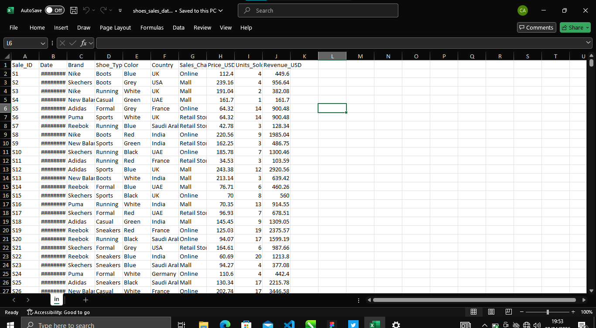
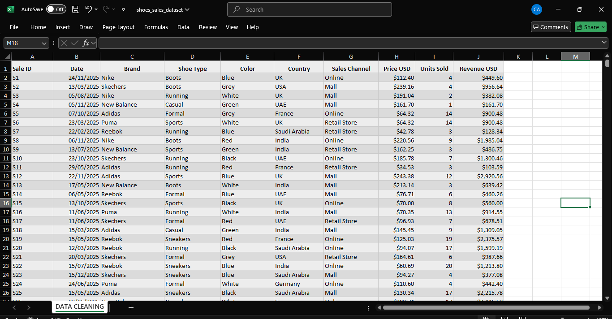
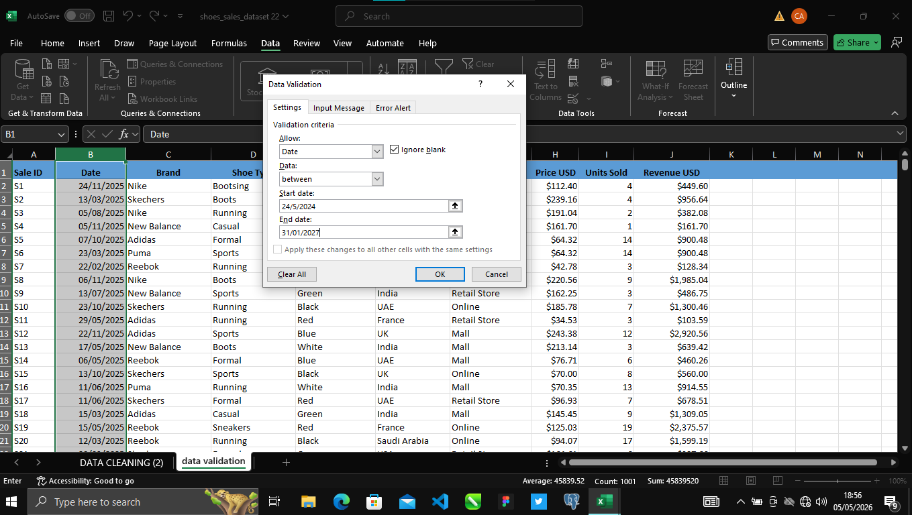

# Excel Data Entry Project

## Project Overview
This project demonstrates data entry and spreadsheet management skills using Microsoft Excel. The work involved organizing records, maintaining data accuracy, formatting information, and preparing structured data for reporting and analysis.

## Tools Used
- Microsoft Excel
- Data Entry
- Data Cleaning
- Spreadsheet Management

## Skills Demonstrated
- Accurate data input and record maintenance
- Data organization and formatting
- Data quality checks
- Sorting and filtering datasets
- Data Validation
- Preparing data for analysis
  
- ## Project Review
This project demonstrates the ability to handle structured data accurately and prepare information for business use. The process involved entering records, reviewing data quality, correcting inconsistencies, and organizing information in Microsoft Excel.

## Key Tasks Completed

- Entered and maintained accurate records in Excel
- Reviewed data for errors and missing information
- Applied formatting to improve readability
- Organized data into a structured table
- Prepared data for reporting and analysis

## Project Screenshots

### Before Data Cleaning

### After Data Cleaning

### Excel Data Management

